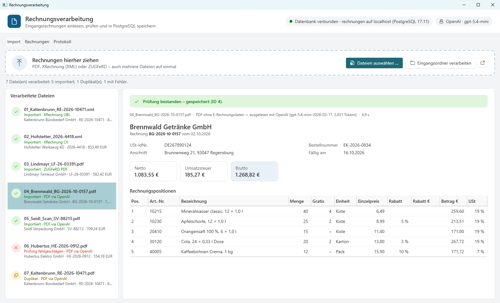
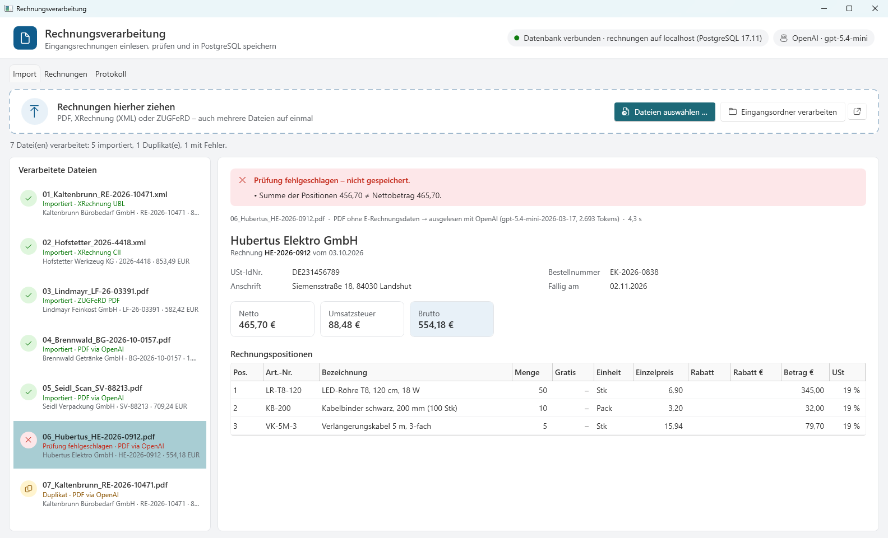
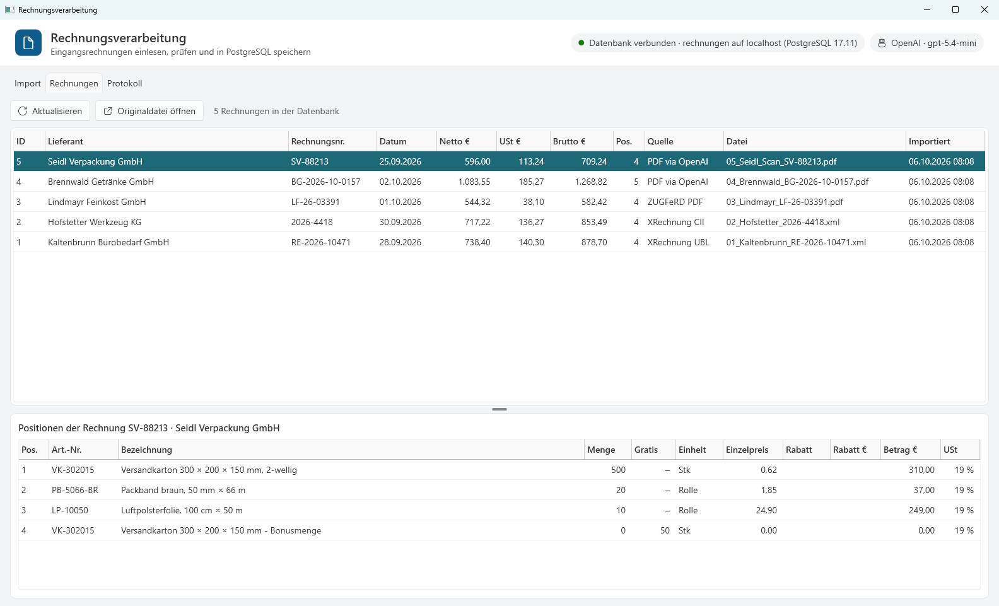
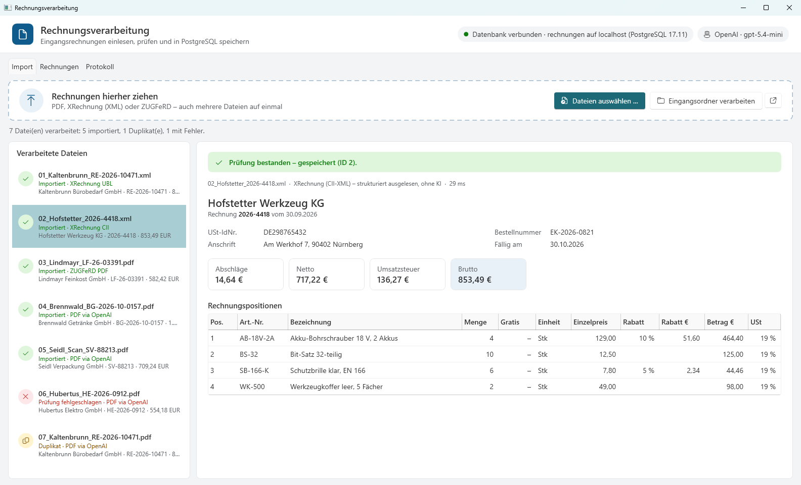
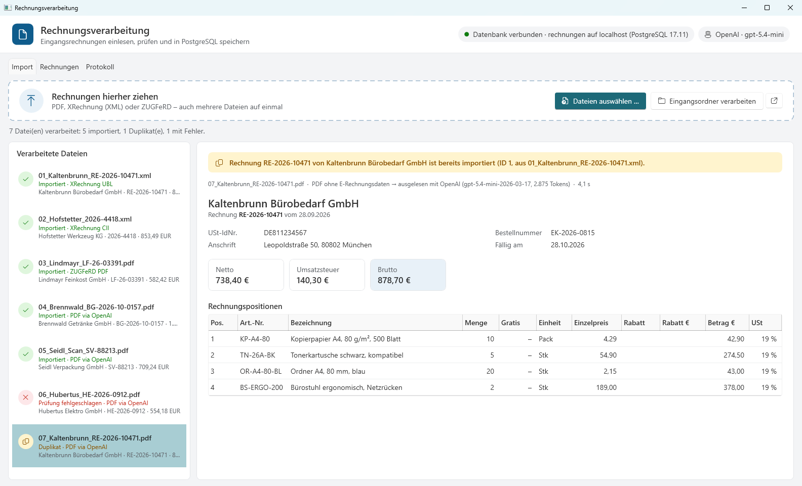
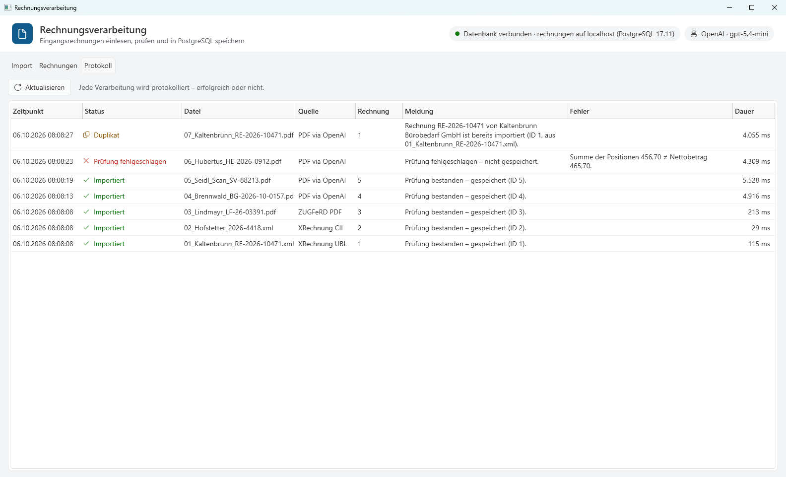
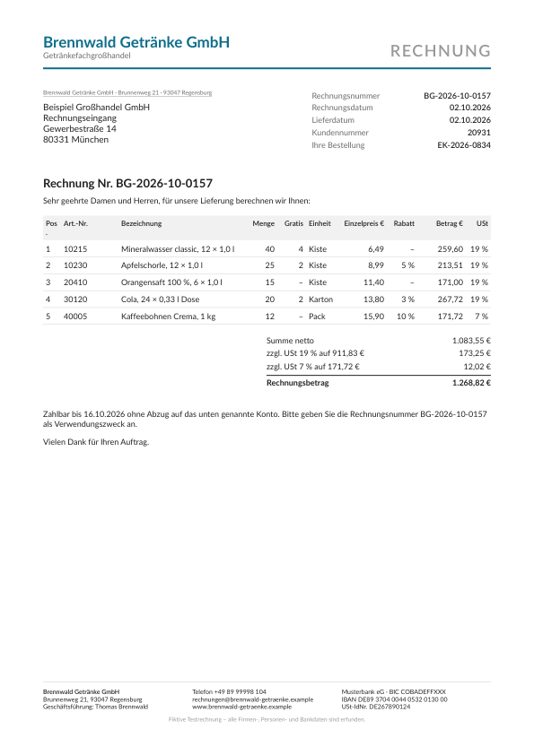
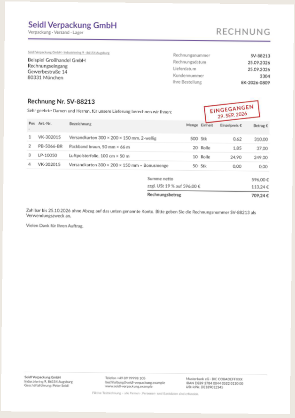

# Invoice Processing — XRechnung, ZUGFeRD & OpenAI

> Windows desktop application that imports supplier invoices, reads e-invoices directly and PDF invoices with the
> OpenAI API, validates every invoice and stores header and line items in PostgreSQL.

[](https://github.com/tatasadi/invoice-processing-xrechnung-openai/actions/workflows/ci.yml)
[](https://dotnet.microsoft.com/)
[](https://www.postgresql.org/)
[](https://platform.openai.com/docs/guides/structured-outputs)
[](LICENSE)



## Overview

Since January 2025, businesses in Germany must be able to receive structured e-invoices (XRechnung, ZUGFeRD).
During the transition period, the incoming mail still mixes e-invoices with plain PDF invoices and scans.
This application handles all of them in one flow:

- **E-invoices are read deterministically**, without AI: XRechnung (UBL and CII syntax) and ZUGFeRD / Factur-X
  (PDF with embedded XML).
- **PDF invoices without e-invoice data** are sent to the OpenAI API, which returns header and line items in a fixed
  JSON schema (Structured Outputs). This also works for scanned invoices without a text layer.
- **Every invoice is validated** before it is stored. An invoice that does not add up is rejected with the reason,
  so AI-extracted data never reaches the database unchecked.
- **Duplicates are blocked**, including the same invoice arriving once as XRechnung and once as PDF.

The user interface, validation messages and log messages are German, because the application targets German
accounting teams. Code, comments and documentation are English.

## Features

| Area | What it does |
|---|---|
| Input | Drag & drop or file dialog (multiple files), or one click to process a defined inbox folder |
| E-invoices | XRechnung UBL + CII and ZUGFeRD / Factur-X via [ZUGFeRD-csharp](https://github.com/stephanstapel/ZUGFeRD-csharp); embedded XML found with [PdfPig](https://github.com/UglyToad/PdfPig) |
| PDF invoices | OpenAI Chat Completions with PDF file input and a strict JSON schema; `store = false` |
| Data | Supplier, VAT ID, invoice number, dates, order reference, totals; per line: article number, description, quantity, free/bonus quantity, unit, unit price, discount, net amount, VAT rate |
| Validation | Required fields, plausible date, quantity × price − discount per line, sum of lines − allowances + charges = net, net + VAT = gross, VAT per rate |
| Duplicates | Same file (SHA-256); same supplier + invoice number (normalized); same number + date + gross amount; unique constraints in the database |
| Storage | PostgreSQL (header and lines in one transaction); original file in an archive folder (`yyyy\MM`) |
| Traceability | Every run in the table `processing_log` (also errors and duplicates) and in a daily log file |
| Resilience | Database or OpenAI not reachable, missing API key → file marked "not processed" and can be imported again; nothing is lost or misfiled |

<table>
  <tr>
    <td></td>
    <td></td>
  </tr>
  <tr>
    <td align="center"><sub>Validation: printed net total ≠ sum of the lines → not stored</sub></td>
    <td align="center"><sub>Stored invoices with line items (PostgreSQL)</sub></td>
  </tr>
</table>

<details>
<summary>More screenshots</summary>

**XRechnung (CII) read without AI**, with line discounts and a loyalty discount on the whole invoice



**Duplicate across formats:** the PDF of an invoice that was already imported as XRechnung



**Processing log:** every run, including duplicates and rejected invoices



</details>

## How it works

```
                        ┌──────────────────────────────────────────────┐
  Drag & drop / dialog  │  WPF app (.NET 10)                           │
  or inbox folder  ───► │  Import · Rechnungen · Protokoll             │
                        └───────────────────┬──────────────────────────┘
                                            ▼
                        ┌──────────────────────────────────────────────┐
                        │  InvoiceProcessor                            │
                        │  1. duplicate? (SHA-256 of the file)         │
                        │  2. read with the first matching reader ─────┼──┐
                        │  3. validate                                 │  │
                        │  4. duplicate? (supplier + invoice number)   │  │
                        │  5. archive original + store in PostgreSQL   │  │
                        │  6. write processing log                     │  │
                        └──────────────────────────────────────────────┘  │
       ┌──────────────────────────────────────────────────────────────────┘
       ▼
  .xml                         → XmlInvoiceReader   XRechnung UBL / CII            no AI
  .pdf with embedded XML       → ZugferdPdfReader   ZUGFeRD / Factur-X             no AI
  any other .pdf (incl. scans) → OpenAiPdfReader    OpenAI, Structured Outputs     gpt-5.4-mini
```

All readers produce the same internal model (`Invoice`, `InvoiceLine`), so validation, duplicate detection and
storage do not depend on the source. A new format or another AI provider is one more `IInvoiceReader`.

## Test invoices

`tools/TestInvoiceGenerator` creates seven fictitious invoices in [`testdata/`](testdata), each covering one case:

| File | Case | Expected result |
|---|---|---|
| `01_Kaltenbrunn_…xml` | XRechnung, UBL syntax | imported |
| `02_Hofstetter_…xml` | XRechnung, CII syntax, line discounts and a loyalty discount on the whole invoice | imported |
| `03_Lindmayr_…pdf` | ZUGFeRD (PDF with embedded XML), 7 % VAT | imported, without AI |
| `04_Brennwald_…pdf` | plain PDF: free goods, line discounts, 19 % and 7 % VAT | imported via OpenAI |
| `05_Seidl_Scan_…pdf` | scan without text layer, receipt stamp, bonus quantity as a separate line | imported via OpenAI |
| `06_Hubertus_…pdf` | printed net total does not match the lines | rejected by validation |
| `07_Kaltenbrunn_…pdf` | the invoice of 01 again, as plain PDF | detected as duplicate |

<table>
  <tr>
    <td></td>
    <td></td>
  </tr>
</table>

All companies and people are fictitious: VAT IDs fail the official check digit on purpose, e-mail and web addresses
use the reserved `.example` domain, phone numbers come from the range reserved for film and TV.

## Getting started

Prerequisites: Windows 10/11, [.NET 10 SDK](https://dotnet.microsoft.com/download), Docker Desktop (or any
PostgreSQL 17), an OpenAI API key (only needed for PDF invoices without e-invoice data).

```powershell
# 1. PostgreSQL (the application creates its tables on startup)
docker compose up -d

# 2. OpenAI API key for development (stored outside the repository)
dotnet user-secrets set "OpenAI:ApiKey" "<your key>" --id invoice-processing

# 3. Run (Development settings: local database, folders under data\)
dotnet run --project src/InvoiceProcessing.App
```

Then drag the files from `testdata\` into the window. `scripts\reset-local.ps1` empties the database and the local
folders; with `-FillInbox` it also puts a few test invoices into the inbox folder.

Self-contained Windows build (no .NET installation needed on the target machine):

```powershell
dotnet publish src/InvoiceProcessing.App -c Release -r win-x64 --self-contained -p:PublishSingleFile=true -o publish
```

## Configuration

`src/InvoiceProcessing.App/appsettings.json` (overridable with environment variables, e.g. `OpenAI__Model`):

| Key | Purpose | Default |
|---|---|---|
| `ConnectionStrings:InvoiceDb` | PostgreSQL connection | `localhost / rechnungen` |
| `Database:CreateSchemaIfMissing` | Run the embedded, idempotent `schema.sql` at startup; `false` for an existing schema | `true` |
| `Storage:InboxPath` | Defined inbox folder | `C:\Rechnungsverarbeitung\Eingang` |
| `Storage:ArchivePath` | Originals of imported invoices | `C:\Rechnungsverarbeitung\Archiv` |
| `Storage:FailedPath` / `DuplicatesPath` | Inbox files that were rejected / already imported (with a `.fehler.txt` stating the reason) | `…\Fehler`, `…\Duplikate` |
| `OpenAI:ApiKey` | API key; falls back to the environment variable `OPENAI_API_KEY` | empty |
| `OpenAI:Model` | Model for PDF invoices | `gpt-5.4-mini` |
| `OpenAI:ReasoningEffort` | For reasoning models; leave empty for others | `low` |
| `OpenAI:MaxOutputTokens` / `TimeoutSeconds` | Limits per request | `16000` / `180` |
| `Validation:AmountTolerance` | Allowed rounding difference per check | `0.02` |
| `Logging:Directory` | Folder for the daily log files | `logs` |

## Project structure

```
invoice-processing-xrechnung-openai/
├── src/
│   ├── InvoiceProcessing.Core/            # model, IInvoiceReader, InvoiceValidator, InvoiceProcessor (no infrastructure)
│   ├── InvoiceProcessing.Infrastructure/  # readers, OpenAI, PostgreSQL (Npgsql + Dapper, schema.sql), archive, import
│   └── InvoiceProcessing.App/             # WPF (MVVM, CommunityToolkit.Mvvm), Generic Host, Serilog
├── tests/
│   └── InvoiceProcessing.Tests/           # unit tests + integration tests against PostgreSQL
├── tools/
│   ├── TestInvoiceGenerator/              # creates the test invoices (QuestPDF + ZUGFeRD-csharp)
│   └── ExtractionCheck/                   # reads files without a database, prints extraction + validation
├── testdata/                              # the seven test invoices
├── scripts/                               # reset-local.ps1, ui-automation.ps1 (UI checks and screenshots)
└── docs/images/                           # screenshots for this README
```

## Testing

```powershell
dotnet test                                            # all tests (integration tests need the PostgreSQL from docker compose)
dotnet test --filter "Category!=Integration"           # unit tests only
dotnet run --project tools/ExtractionCheck -- testdata # check readers and prompt without a database
```

The integration tests create their own database `rechnungen_test` and cover storage with line items, the processing
log, the archive, duplicates by file and across formats, and the clean-up of the inbox folder.
[CI](.github/workflows/ci.yml) builds the solution and runs the unit tests on Windows, and runs all tests on Linux
against a PostgreSQL service container.

## Design decisions

The main choices and their alternatives are documented in [DECISIONS.md](DECISIONS.md), among them: AI only as a
fallback for PDFs, Structured Outputs with direct PDF input, the choice of `gpt-5.4-mini` (measured against
`gpt-5-mini`), the validation gate before storage, duplicate detection on three levels and Dapper with plain SQL
instead of an ORM.

## Data protection and limits

- Only PDF invoices without e-invoice data are sent to OpenAI; XRechnung and ZUGFeRD are processed locally.
  Requests are sent with `store = false`. Whether invoice data may be sent to an external service (data processing
  agreement, data residency) is the operator's decision. Switching to Azure OpenAI (e.g. an EU data zone) is a small
  change in `OpenAiPdfReader`, because the OpenAI .NET SDK supports both.
- Very small print on low-resolution scans can be misread (e.g. the sender line). Amounts are protected by the
  validation and suppliers are matched by VAT ID, but an unusual name or address on a scan should be checked.
- XML is parsed with DTD processing prohibited.
- The application prepares data for accounting; it does not replace the accounting review or a GoBD-compliant archive.

## Extension points

- New format or AI provider: implement `IInvoiceReader` and register it in `ServiceCollectionExtensions`
  (registration order = priority).
- Existing database model: adapt `schema.sql` and the SQL in `PostgresInvoiceRepository`; the other layers work on
  the internal model.
- Additional business rules: `InvoiceValidator`.

## License

[MIT](LICENSE). Runtime dependencies are open source (MIT, Apache 2.0, PostgreSQL License). QuestPDF (community
license) is used only by the test invoice generator.

## Author

**Ehsan Tatasadi** — Senior .NET & Azure Engineer, Hamburg ·
[ehsan.tatasadi.com](https://ehsan.tatasadi.com) · [LinkedIn](https://www.linkedin.com/in/ehsan-tatasadi/)
